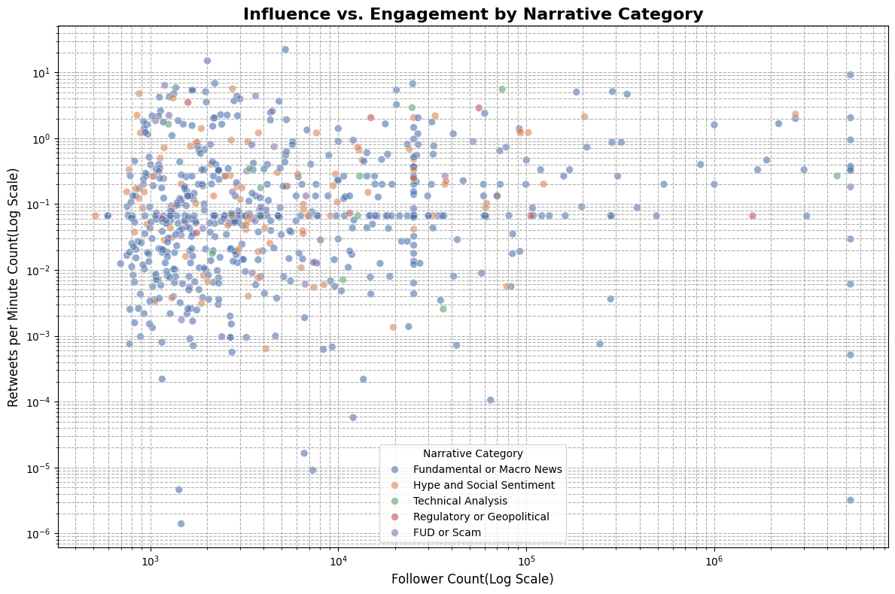
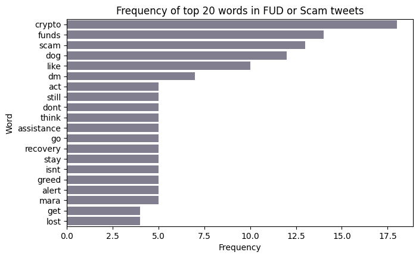
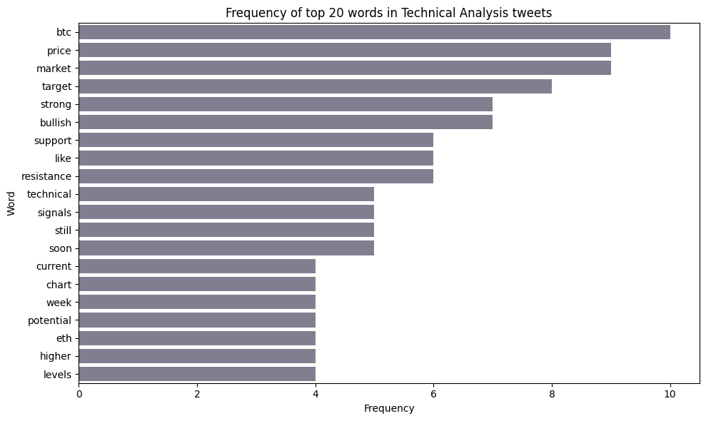
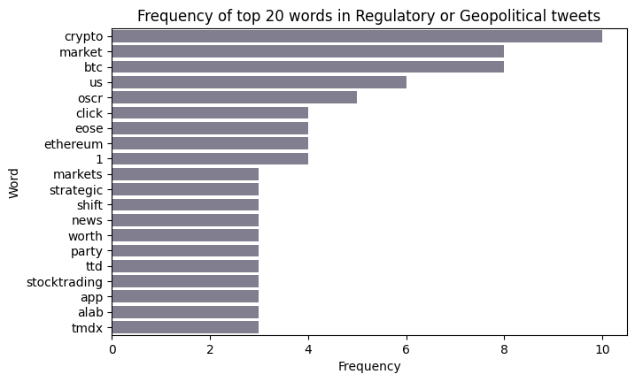
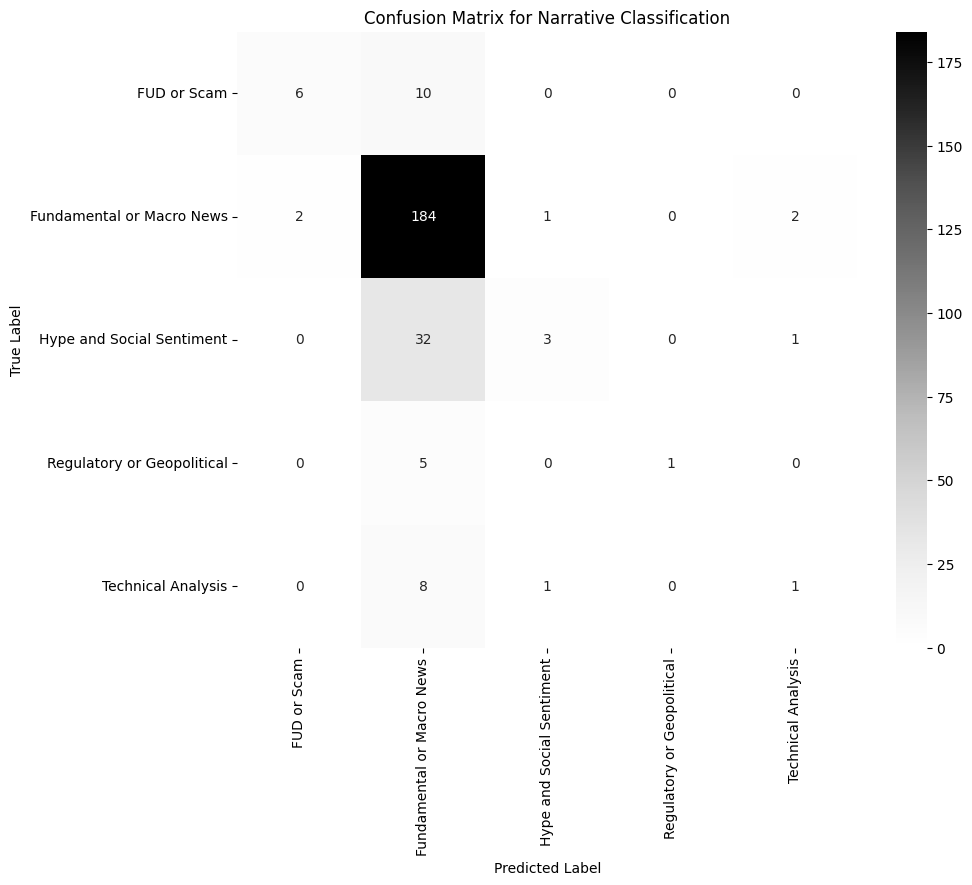

# Bitcoin Narrative Component Analysis: A Multi-Class NLP Classifier

### Project Status: Phase 1 Complete (Data Engineering & Automated Labeling)

## Project Overview

This project is an end-to-end data science endeavor to move beyond simple sentiment analysis and dissect the public conversation on X (formerly Twitter) into distinct, meaningful **narrative components**. The goal was to build a classifier that could understand the qualitative drivers of the Bitcoin market—distinguishing between fundamental news, social media hype, and FUD, among other themes.
This repository contains the complete data pipeline built with Python and Selenium to scrape, process, and automatically label a high-quality dataset of over 1,500 tweets. This labeled dataset serves as the foundation for training advanced machine learning models for real-time narrative classification.
The project became a case study in diagnosing and solving the challenges of real-world, noisy, and severely **imbalanced data**. Through a systematic process of experimentation, the final champion model—a tuned **LightGBM** classifier using a **SMOTE-based pipeline**—achieved a **0.70 weighted F1-score** on the unseen test set.

## Key Skills & Technologies

*   **Data Scraping:** Developed a robust, automated scraper using **Selenium**, **webdriver-manager**, and **selenium-stealth** to bypass bot detection and gather real-time data from X.
*   **Data Engineering:** Built a multi-stage data pipeline in **Python** that handles:
    *   Filtering tweets by author influence (follower count).
    *   Capturing engagement metrics (retweets) with a delayed revisit strategy.
    *   Detecting and translating non-English tweets.
*   **API Integration:** Interfaced with the **Hugging Face Inference API** to perform zero-shot text classification, automatically labeling the entire 1,500+ tweet dataset.
*   **Data Cleaning & Analysis:** Used **Pandas** and **NumPy** to clean, process, and perform initial exploratory data analysis (EDA) on the collected data.
*   **Environment Management:** Utilized **virtual environments** and managed secret credentials with a `.env` file.
*   **Feature Extraction & EDA:** Utilized **TF-IDF Vectorization** for feature creation and performed **Word Frequency Analysis** with NLTK to validate the textual distinctiveness of each narrative category.
*   **Advanced ML Modeling & Tuning:** Trained and evaluated multiple classifiers, including **LightGBM** and **XGBoost**, using `RandomizedSearchCV` to optimize performance.
*   **Imbalanced Data Handling:** Systematically experimented with four advanced techniques: **SMOTE**, **RandomUnderSampler**, **`class_weight` balancing**, and the hybrid **SMOTEENN** using the `imblearn` library.
*   **Rigorous Model Validation:** Implemented a strict **train-test split** to prevent data leakage and evaluated models using **F1-score**, classification reports, and confusion matrices to ensure robust and honest performance metrics.

## The Problem: Understanding "Why" the Market Moves

While quantitative data (price, volume) can tell us *what* the market is doing, it often fails to explain *why*. A price rally driven by a fundamental news event (like an ETF approval) has a very different risk profile than one driven by social media hype. This project aims to provide this crucial context by categorizing tweets into their core themes.

## Phase 1 Achievements: The Labeled Dataset

This initial phase focused on creating a high-quality, labeled dataset, which is a critical first step in any supervised learning project.

1.  **Data Collection:** A multi-day scraping process was run to collect over 1,500 Bitcoin-related tweets from influential authors.
2.  **Language Processing:** A custom language processing module was used to detect the language of each tweet and translate non-English text to ensure a consistent dataset.
3.  **Automated Zero-Shot Labeling:** Using the powerful **`facebook/bart-large-mnli`** model via the Hugging Face API, each tweet was programmatically classified into one of five narrative components:
    *   `Fundamental or Macro News`
    *   `Technical Analysis`
    *   `Hype and Social Sentiment`
    *   `Regulatory or Geopolitical`
    *   `FUD or Scam`

The final labeled dataset is the primary deliverable of this phase and is ready for model training.

## Preliminary Insights (EDA)

Even before model training, the labeled data reveals fascinating patterns. The distribution of narratives shows a conversation dominated by 'Hype & Social Sentiment', while the relationship between author influence and tweet engagement varies significantly across different narrative types.

## Phase 2: From EDA to a Champion Model

With the labeled dataset in hand, Phase 2 focused on training, evaluating, and rigorously testing a suite of machine learning models to automate the classification task.

### Exploratory Data Analysis: Is the Language Actually Different?

Before modeling, it was critical to validate that the narrative categories were textually distinct. A word frequency analysis was performed on the cleaned text for each class, which yielded crucial insights and helped to set realistic expectations.

<!-- Insert your new composite image here. e.g., plots/word_freq_comparison.png -->
| Top 20 words for "FUD or Scam"               | Top 20 words for Top 20 words for "Technical Analysis"| Top 20 words for Top 20 words for "Regulatory or Geopolitical"|               
| -------------------------------------------- | ----------------------------------------------------- | ------------------------------------------------------------- |
|                   |                          |                              |

The analysis revealed:
*   **High-Signal Classes:** Categories like **"FUD or Scam"** (`scam`, `lost`, `alert`) and **"Technical Analysis"** (`price`, `target`, `resistance`) showed highly unique vocabularies, providing a strong signal for a classifier.
*   **Low-Signal Challenge:** Conversely, the **"Regulatory or Geopolitical"** class showed a weak signal, with its most frequent words being generic terms (`crypto`, `market`) that heavily overlap with other categories. This correctly predicted that it would be the most difficult class for any model to learn.

### The Modeling Challenge: A Battle with Class Imbalance

The primary modeling challenge was the severe class imbalance, with a **30:1 ratio** between the largest and smallest classes. A systematic approach was taken to find the best strategy to handle this.

<!-- Insert your Class Distribution bar chart here. e.g., plots/distribution_of_narrative_category.png -->

#### 1. The Champion Model & The Overfitting Diagnosis

A pipeline using **SMOTE** (oversampling) and a tuned **LightGBM** classifier was the top performer.

| Model | Train F1-Score | Test F1-Score | Gap (Overfitting) |
| :--- | :---: | :---: | :---: |
| **LightGBM + SMOTE** | **0.96** | **0.70** | **-0.26** |

**Diagnosis:** While the **0.70 test F1-score was a strong and realistic result**, the 26-point gap indicated significant overfitting. The model was mastering the patterns of the artificial SMOTE data, but these patterns did not perfectly generalize to the imbalanced, real-world test set.

#### 2. Experimental Validation
To confirm SMOTE was the best approach despite the gap, I tested three alternative strategies.

| Strategy | Test F1-Score | Result & Diagnosis |
| :--- | :---: | :--- |
| **`class_weight` balancing** | 0.54 | Failed to learn minority patterns effectively. |
| **RandomUnderSampler** | 0.53 | Failed due to **Data Starvation**. |
| **SMOTEENN (Hybrid)** | 0.37 | **Catastrophic Failure;** the cleaning step was too aggressive. |

**Conclusion of Experiments:** This rigorous comparison proved that the SMOTE-based pipeline was the undisputed champion. The alternative methods, while reducing overfitting, did so by destroying the model's predictive power.

### Final Conclusion

The final champion model is the LightGBM pipeline using SMOTE with the tuned hyperparameters. It achieved the best real-world performance with a **weighted F1-score of 0.70**.

The key takeaway is a lesson in the trade-offs of machine learning. The analysis conclusively shows that the overfitting gap is a direct, measurable artifact of using a synthetic oversampling strategy on a dataset with very small, low-signal minority classes. The 0.70 F1-score represents the best achievable performance with the current data and feature set.

<!-- Insert your final, best Confusion Matrix here. e.g., plots/final_confusion_matrix.png -->

### Future Work

The analysis demonstrates that the limits of a model-centric approach have been reached. The clear path to improving the 0.70 score and closing the generalization gap is a **data-centric one**:

-   **Feature Engineering:** Create new features to provide a richer signal, such as sentiment analysis scores (e.g., using VADER) and other text-based metadata.
-   **Data Augmentation (Most Promising):** A targeted web scraping and manual labeling effort to increase the number of *real samples* for the minority classes would make the training set more representative of reality and directly address the root cause of the overfitting.

## How to Run This Project

1.  Clone this repository.
2.  Create and activate a Python virtual environment.
3.  Install the required dependencies
4.  Create a `secrets/.env` file and add your X (Twitter) credentials and your Hugging Face API token.
5.  The data collection pipeline can be run via `twitter_scraping_main_code.py`.
6.  The data labeling is performed in `label_tweets.py`.
