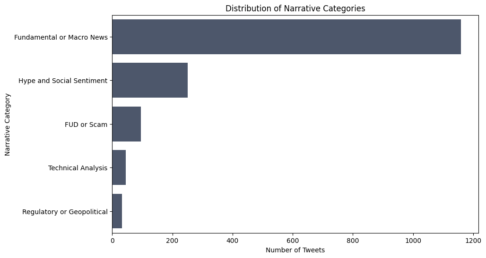

# Bitcoin Narrative Component Analysis

### Project Status: Phase 1 Complete (Data Engineering & Automated Labeling)

## Project Overview

This project is the first phase of a larger analysis aimed at understanding the qualitative drivers of the Bitcoin market. The goal is to move beyond simple sentiment analysis and dissect the public conversation on X (formerly Twitter) into distinct, meaningful **narrative components**.

This repository contains the complete data pipeline built with Python and Selenium to scrape, process, and automatically label a high-quality dataset of over 1,500 tweets. This labeled dataset serves as the foundation for training advanced machine learning models for real-time narrative classification.

## Key Skills & Technologies

*   **Data Scraping:** Developed a robust, automated scraper using **Selenium**, **webdriver-manager**, and **selenium-stealth** to bypass bot detection and gather real-time data from X.
*   **Data Engineering:** Built a multi-stage data pipeline in **Python** that handles:
    *   Filtering tweets by author influence (follower count).
    *   Capturing engagement metrics (retweets) with a delayed revisit strategy.
    *   Detecting and translating non-English tweets.
*   **API Integration:** Interfaced with the **Hugging Face Inference API** to perform zero-shot text classification, automatically labeling the entire 1,500+ tweet dataset.
*   **Data Cleaning & Analysis:** Used **Pandas** and **NumPy** to clean, process, and perform initial exploratory data analysis (EDA) on the collected data.
*   **Environment Management:** Utilized **virtual environments** and managed secret credentials with a `.env` file.

## The Problem: Understanding "Why" the Market Moves

While quantitative data (price, volume) can tell us *what* the market is doing, it often fails to explain *why*. A price rally driven by a fundamental news event (like an ETF approval) has a very different risk profile than one driven by social media hype. This project aims to provide this crucial context by categorizing tweets into their core themes.

## Phase 1 Achievements: The Labeled Dataset

This initial phase focused on creating a high-quality, labeled dataset, which is a critical first step in any supervised learning project.

1.  **Data Collection:** A multi-day scraping process was run to collect over 1,500 Bitcoin-related tweets from influential authors.
2.  **Language Processing:** A custom language processing module was used to detect the language of each tweet and translate non-English text to ensure a consistent dataset.
3.  **Automated Zero-Shot Labeling:** Using the powerful **`facebook/bart-large-mnli`** model via the Hugging Face API, each tweet was programmatically classified into one of five narrative components:
    *   `Fundamental or Macro News`
    *   `Technical Analysis`
    *   `Hype and Social Sentiment`
    *   `Regulatory or Geopolitical`
    *   `FUD or Scam`

The final labeled dataset is the primary deliverable of this phase and is ready for model training.

## Preliminary Insights (EDA)

Even before model training, the labeled data reveals fascinating patterns. The distribution of narratives shows a conversation dominated by 'Hype & Social Sentiment', while the relationship between author influence and tweet engagement varies significantly across different narrative types.

## Next Steps: Phase 2 (Model Training & Evaluation)

The next phase of this project will focus on building and evaluating machine learning models to automate this classification task:

-   **Model Training:** Train a suite of classifiers (Naive Bayes, **SVM**, **XGBoost**) on the labeled dataset using TF-IDF text features.
-   **Evaluation:** Compare model performance using robust metrics like the F1-score and confusion matrices.
-   **Final Goal:** Create a production-ready model that can take any new tweet about Bitcoin and instantly assign it a narrative label, providing a real-time stream of qualitative market intelligence.

## How to Run This Project

1.  Clone this repository.
2.  Create and activate a Python virtual environment.
3.  Install the required dependencies
4.  Create a `secrets/.env` file and add your X (Twitter) credentials and your Hugging Face API token.
5.  The data collection pipeline can be run via `twitter_scraping_main_code.py`.
6.  The data labeling is performed in `label_tweets.py`.
